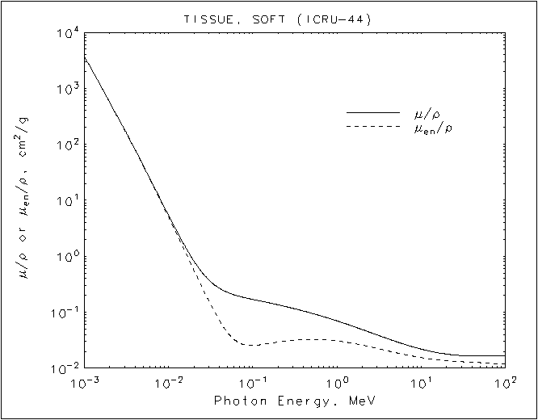
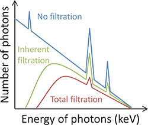

% Ermittlung Atomarer Zusammensetzung durch multispektrales Röntgen
% Tobias Kienzler
% 21.09.2018

# Motivation
- Unterstützung der Röntgendiagnostik: Atomare Zusammensetzung
- Gängige Detektoren: Komplettes Spektrum absorbiert (Ausnahme: DXA)
- Untersuchung möglicher Adaption existierender Aufbauten

# Grundlagen: Absorption
- Absorption elektromagnetischer Strahlung **exponentiell** in Dicke $d$, Lambert-Beersches Gesetz:  
$$I = I_0\cdot\exp{\left(-\mu\cdot d\right)}$$
- Massenschwächungskoeffizient $\mu/\rho$ abhängig von Photonenenergie
- Tabelliert, z.B. <https://www.nist.gov/pml/x-ray-mass-attenuation-coefficients>  

- Zusammengesetztes Material: Integration (vgl. Hounsfield-Skala im CT)  
$$I = I_0\cdot\int \mu(x)\, dx$$

# Grundlagen: Röhrenspektrum & Detektor
- Emittiertes Spektrum kontinuierlich, abhängig von Anodenmaterial, Filter und Beschleunigungsspannung  

- Detektor registriert alle Photonen, kein monochromatisches Abfahren einzelner Wellenlängen möglich

# Dual-Röntgen-Absorptiometrie (DXA)

# Triple-Röntgen-Absorptiometrie

# Multispektrale Röntgen-Absorptiometrie

# Alternative: Filtervariation

# Abschätzung Patientendosis

# Ausblick
- Kombination CT oder Parallaxenverschiebung