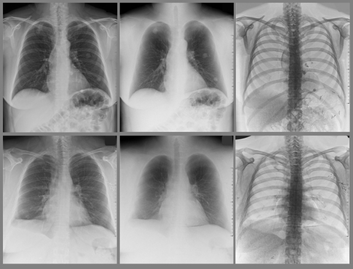

---
title: Ermittlung Atomarer Zusammensetzung durch multispektrales Röntgen
author: Tobias Kienzler
date: 21.09.2018
...

# Motivation
- Unterstützung der Röntgendiagnostik:  
Atomare Zusammensetzung
- Gängige Detektoren: Komplettes Spektrum absorbiert  
(Ausnahme: DXA)
- Untersuchung möglicher Adaption existierender Aufbauten

# Grundlagen: Absorption I
- Absorption elektromagnetischer Strahlung **exponentiell** in Dicke $d$, Lambert-Beersches Gesetz:  
$$I = I_0\cdot\exp{\left(-\mu\cdot d\right)}$$
- Zusammengesetztes Material: Integration (vgl. Hounsfield-Skala im CT)  
$$I = I_0\cdot\exp{\left(\int \mu(x)\, dx\right)}$$
- Massenschwächungskoeffizient $\mu/\rho$ abhängig von Photonenenergie

# Grundlagen: Absorption II
- Tabelliert, z.B. <https://www.nist.gov/pml/x-ray-mass-attenuation-coefficients>  
{ height=50% }

# Grundlagen: Röhrenspektrum & Detektor
- Emittiertes Spektrum kontinuierlich, abhängig von Anodenmaterial, Filter und Beschleunigungsspannung  
[{ height=40% }](https://www.radiologycafe.com/radiology-trainees/frcr-physics-notes/production-of-x-rays)
- Detektor registriert alle Photonen, kein monochromatisches Abfahren einzelner Wellenlängen möglich

# Dual-Röntgen-Absorptiometrie (DXA)
- Subtraktion zweier Aufnahmen bei unterschiedlicher Energie  
[{ height=50%}  
\tiny [http://www.upstate.edu/radiology/education/rsna/radiography/dual.php]](http://www.upstate.edu/radiology/education/rsna/radiography/dual.php)
- Anwendung z.B. Knochendichtemessung

# Triple-Röntgen-Absorptiometrie

# Multispektrale Röntgen-Absorptiometrie

# Alternative: Filtervariation

# Abschätzung Patientendosis

# Ausblick
- Kombination CT oder Parallaxenverschiebung